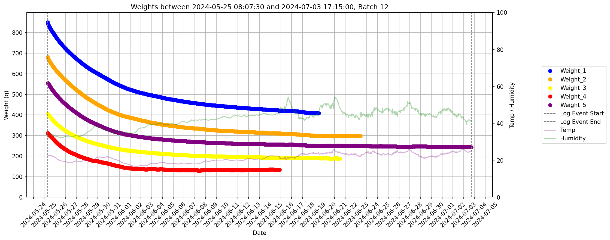
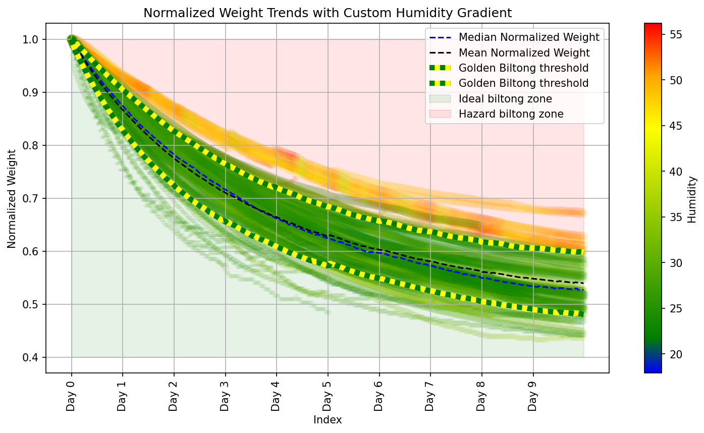

# Biltong Drying: Data Analysis & Machine Learning

## tl;dr
A data processing and machine learning model to predict biltong curing times based on temperature and humidity.

---

This project explores how temperature and humidity impact the drying process of biltong (jerky). Data was collected using custom-built hardware that logged environmental conditions to an SD card during multiple drying cycles.

The project consists of two main components:
1. **`Biltonger_data_analysis.ipynb`** – Handles data collection, processing, and statistical analysis.
2. **`Bilton_ML.ipynb`** – Uses the processed data to train a machine learning model.

The goal is to predict curing time using current temperature, humidity, and three lagging weight measurements. The model, a Random Forest Regressor, provides real-time estimates of drying progress and identifies optimal drying conditions.

---

## Visual Overview

### Raw Data from a Batch

*Example of raw data collected during a single biltong batch.*

### Environmental Risk Zones

*Red zone indicates high risk of mold due to slow drying. Green zone typically results in safe, effective curing.*

### Curve Fitting

*Processed data used to compute mean, standard deviation, and apply a fitted curve.*

### Overlay of All Batches

*Each batch plotted over the fitted curve for trend comparison.*

### Predictive Modeling

*Random Forest Regressor predicts weight loss over time based on environmental inputs.*

### 3D Heatmap: Curing Time Prediction

*Model output shown as a 3D heatmap using humidity and temperature as inputs.*

---

## License

This work is licensed under the [Creative Commons Attribution-NonCommercial 4.0 International License](https://creativecommons.org/licenses/by-nc/4.0/).

You are free to:
- **Share** — copy and redistribute the material in any medium or format  
- **Adapt** — remix, transform, and build upon the material  

Under the following terms:
- **Attribution** — You must give appropriate credit to [Nordtus.com](https://nordtus.com), provide a link to the license, and indicate if changes were made.  
- **NonCommercial** — You may not use the material for commercial purposes.  
- **Redistribution** — You may share this work, with attribution, but not for commercial gain.

